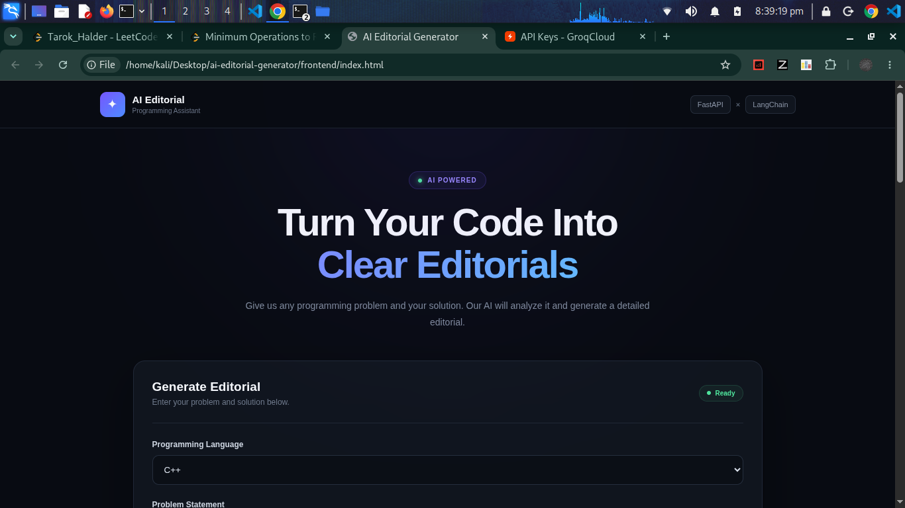
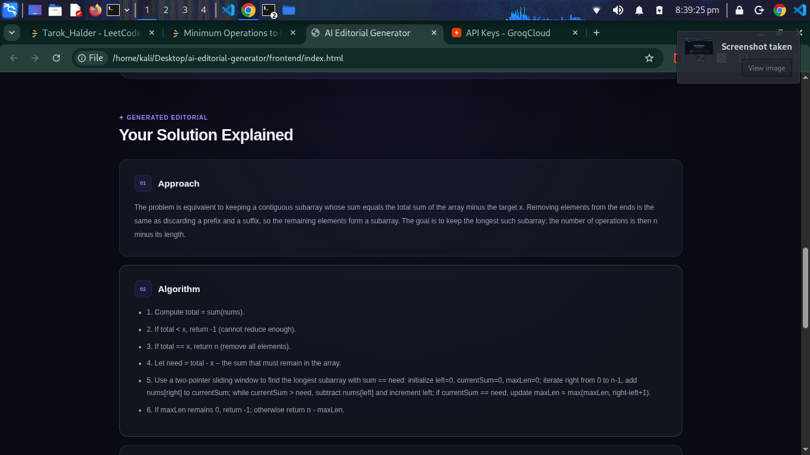
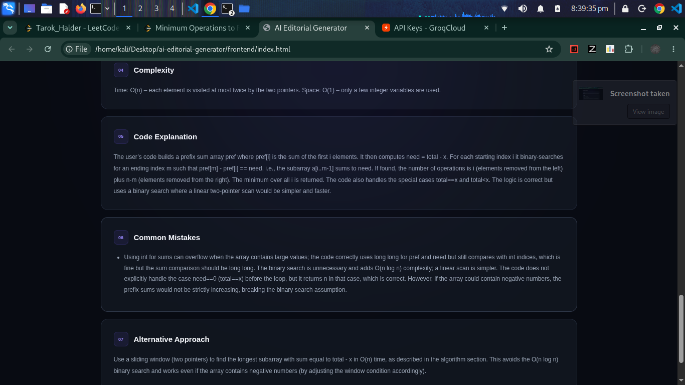

# AI Editorial Generator

An AI-powered programming editorial generator that analyzes a programming problem and the user's code and generates a structured editorial.

## Preview

<p align="center">
  
  
  
</p>

## Features

- Generate programming problem-solving approaches
- Generate step-by-step algorithms
- Explain why the solution works
- Analyze time and space complexity
- Explain the submitted code
- Identify common mistakes
- Provide alternative approaches
- Structured AI-generated responses

## Tech Stack

- Python
- FastAPI
- LangChain
- Groq
- Pydantic
- HTML
- CSS
- JavaScript

## Architecture

```text
User
  │
  ▼
Frontend
  │
  │ HTTP Request
  ▼
FastAPI
  │
  ▼
LangChain
  │
  ▼
Groq LLM
  │
  ▼
AI Editorial
  │
  ▼
Frontend
```

## Project Structure

```text
ai-editorial-generator/
│
├── backend/
│   ├── main.py
│   ├── langchain_service.py
│   ├── schemas.py
│   ├── requirements.txt
│   └── .env
│
├── frontend/
│   ├── index.html
│   ├── style.css
│   └── script.js
│
└── screenshots/
    ├── image1.png
    ├── image2.png
    └── image3.png
```

## API

### Generate Editorial

```text
POST /api/editorial
```

### Request

```json
{
  "problem": "Programming problem statement",
  "code": "User submitted code",
  "language": "C++"
}
```

### Response

```json
{
  "approach": "Solution approach",
  "algorithm": [
    "Step 1",
    "Step 2",
    "Step 3"
  ],
  "why_it_works": "Explanation of correctness",
  "complexity": "Time: O(n), Space: O(n)",
  "code_explanation": "Explanation of the submitted code",
  "common_mistakes": [
    "Common mistake 1",
    "Common mistake 2"
  ],
  "alternative_approach": "Alternative solution"
}
```

## How It Works

The user provides a programming problem, source code, and programming language. The frontend sends the data to the FastAPI backend.

The backend passes the information to LangChain, which communicates with the Groq LLM. The generated response is validated using Pydantic and returned to the frontend as a structured editorial.

## Installation

Clone the repository:

```bash
git clone <your-repository-url>
cd ai-editorial-generator
```

Create a virtual environment:

```bash
cd backend
python3 -m venv venv
source venv/bin/activate
```

Install dependencies:

```bash
pip install -r requirements.txt
```

Create a `.env` file inside the `backend` directory:

```env
GROQ_API_KEY=your_groq_api_key
```

Run the backend:

```bash
uvicorn main:app --reload
```

Run the frontend from another terminal:

```bash
cd frontend
python3 -m http.server 5500
```

Open the application:

```text
http://127.0.0.1:5500
```

## Learning Project

This project was built as a learning project to practice building an LLM-powered application using FastAPI and LangChain.

Through this project, I practiced:

- FastAPI REST API development
- LangChain
- Groq LLM integration
- Prompt engineering
- Pydantic validation
- JSON parsing
- Frontend and backend integration
- Environment variable management

## License

This project is for learning and educational purposes.
