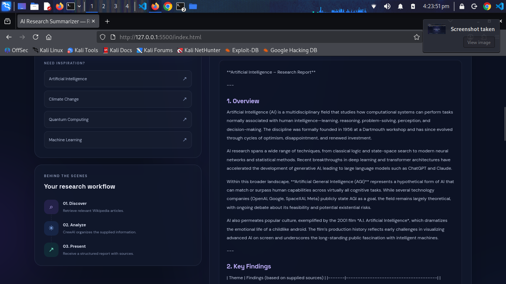
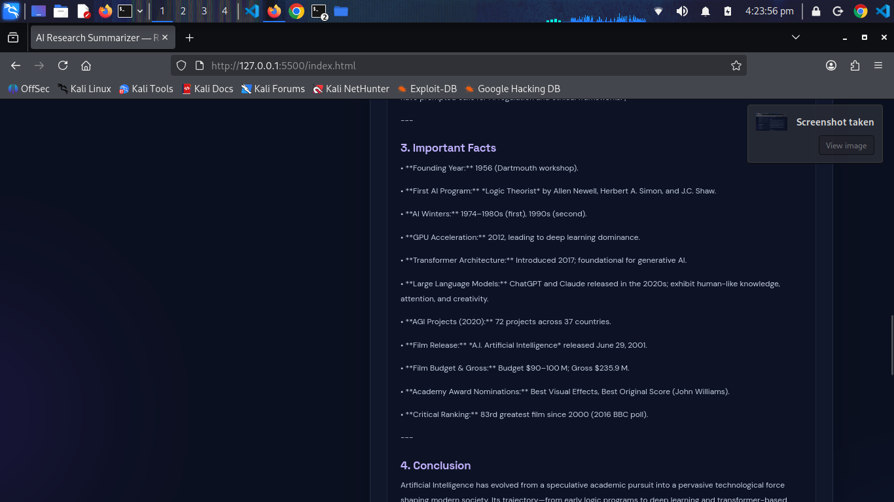
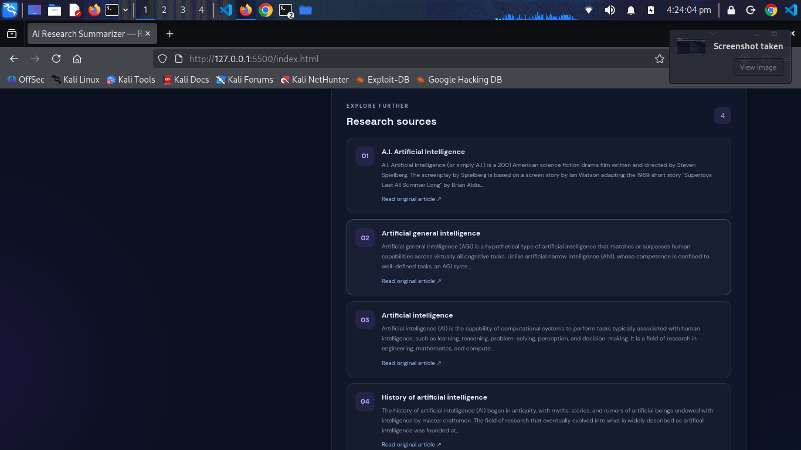
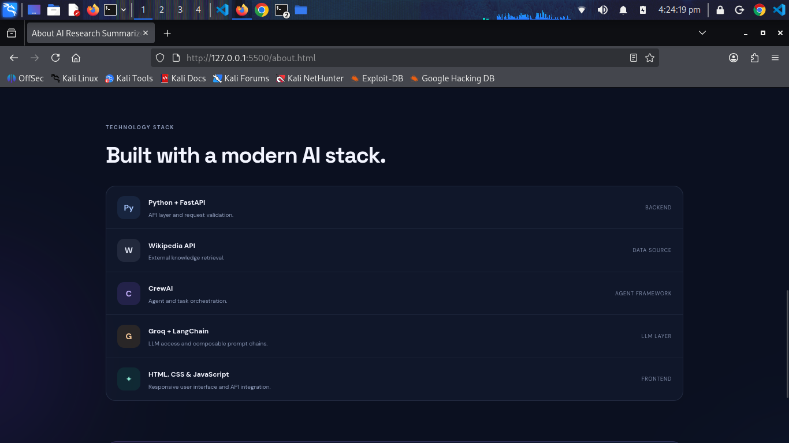

# ✨ AI Research Summarizer

### Turn Curiosity into Clarity with AI-Powered Research

AI Research Summarizer is an AI-powered research assistant that transforms topics into structured, readable research reports using Wikipedia, CrewAI, LangChain, Groq, and FastAPI.

Explore new concepts, discover relevant sources, and organize information through a modern research workspace.

## 📸 Screenshots

### Research Workspace


### Research Interface


### Generated Research Results


### Structured Research Report


### About the Project


## 🚀 Features

- 🔎 **Topic-Based Research:** Enter any topic to begin exploring.
- 📚 **Wikipedia Integration:** Retrieve relevant article information and source links.
- 🤖 **AI-Powered Analysis:** Use CrewAI to organize retrieved information.
- 📝 **Structured Reports:** Generate clear, organized research summaries.
- 🔗 **Source Exploration:** Access original sources for further reading.
- 📋 **Copy Report:** Copy generated research content.
- 💡 **Suggested Topics:** Explore AI, climate change, quantum computing, and more.
- 🎨 **Modern UI:** Enjoy a clean and visually appealing interface.
- ⚡ **Groq Integration:** Access Groq-hosted language models.

## 🛠️ Technology Stack

- **Python** — Backend programming
- **FastAPI** — API development
- **CrewAI** — AI agent orchestration
- **LangChain** — LLM integration and prompt management
- **Groq** — Language model inference
- **Wikipedia API** — Knowledge retrieval
- **HTML5** — Webpage structure
- **CSS3** — Styling and responsive design
- **JavaScript** — Frontend interactions and API requests

## 🔄 How It Works

1. The user enters a research topic.
2. The frontend sends a request to the FastAPI backend.
3. The backend retrieves relevant information from Wikipedia.
4. CrewAI organizes the retrieved information using a Groq-powered language model.
5. The application generates a structured research report.
6. The frontend displays the report and available source links.

## ⚙️ Installation and Setup

### Prerequisites

- Python
- pip
- A Groq API key

### 1. Install Dependencies

Navigate to the backend directory and install the project dependencies:

```bash
cd backend
pip install -r requirements.txt
```

### 2. Configure Environment Variables

Create a `.env` file inside the backend directory:

```env
GROQ_API_KEY=your_groq_api_key_here
```

Replace the placeholder with your actual Groq API key. Never upload your API key to GitHub.

### 3. Start the Backend

From the backend directory, run:

```bash
uvicorn main:app --reload
```

The API will be available at:

`http://127.0.0.1:8000`

Interactive API documentation:

`http://127.0.0.1:8000/docs`

### 4. Start the Frontend

Open another terminal:

```bash
cd frontend
python -m http.server 5500
```

Open the application:

`http://127.0.0.1:5500/index.html`

**Note:** Make sure the API URL configured in `script.js` matches the backend address. Configure CORS if the frontend and backend run on different origins.

## 🎯 Use Cases

- Exploring artificial intelligence and machine learning
- Researching scientific and environmental topics
- Learning about unfamiliar concepts
- Gathering introductory information for academic projects
- Finding sources for further reading

## 🔮 Future Improvements

- PDF report export
- Research history and saved reports
- Integration with additional information sources
- Specialized AI research agents
- Improved source verification
- User authentication and personalized workspaces

## ⚠️ Limitations

- Report quality depends on available source information.
- AI-generated content may contain inaccuracies.
- API and model usage limits may affect availability.
- Important information should be verified against original sources.

## 🔐 Security

- Never commit API keys or secrets.
- Keep `.env` excluded from version control.
- Validate user input on the backend.
- Configure CORS appropriately for deployment.

## 📄 License

Add a license file if you intend to distribute this project as open-source software.

## 👨‍💻 Author

**Tarok Halder**

Passionate about Artificial Intelligence, Backend Development, and Competitive Programming.

<p align="left">
  <a href="https://github.com/tarokhalder">
    
  </a>
</p>

🔗 **GitHub Profile:** [github.com/tarokhalder](https://github.com/tarokhalder)

---

<p align="center">
  <b>AI Research Summarizer</b>
  <br>
  Built with Python, FastAPI, CrewAI, LangChain, Groq, and Wikipedia.
  <br><br>
  <i>Curiosity deserves a workspace. ✨</i>
</p>
